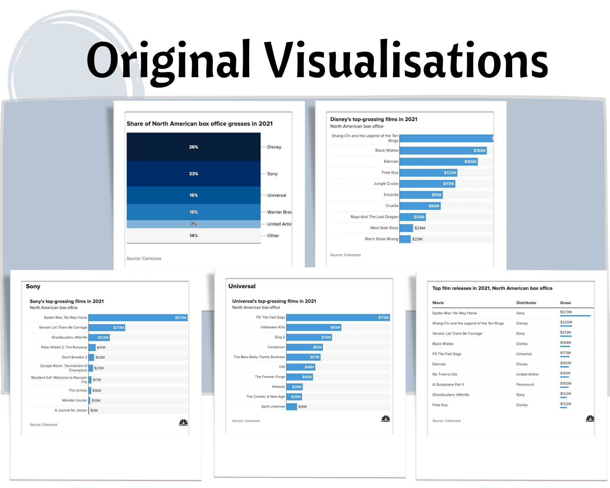
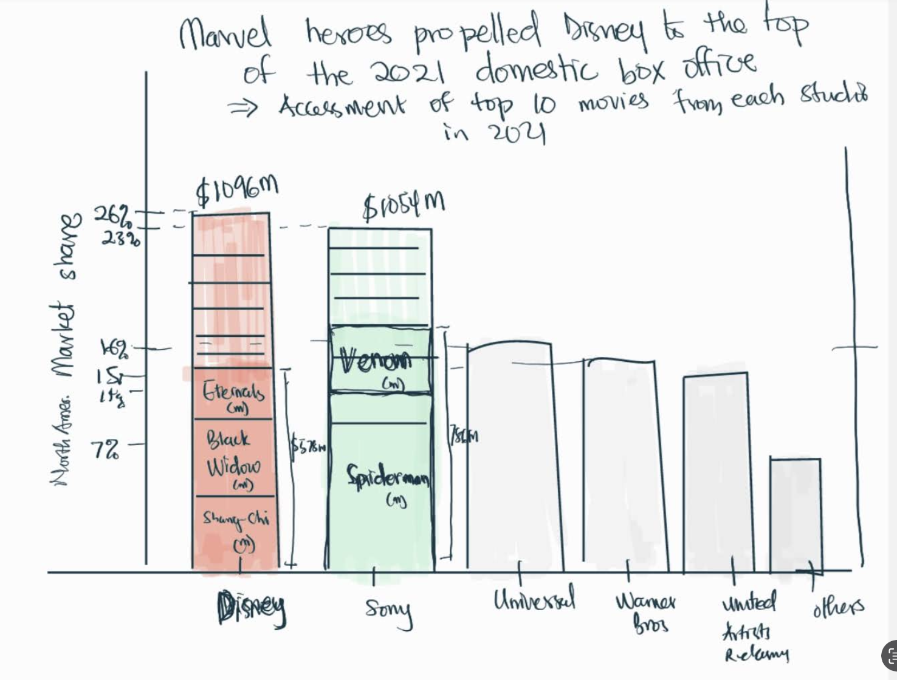
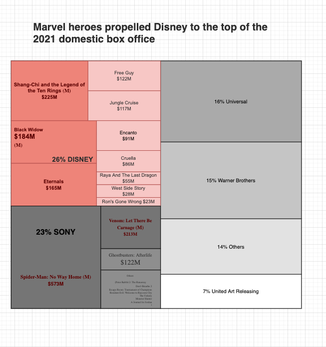
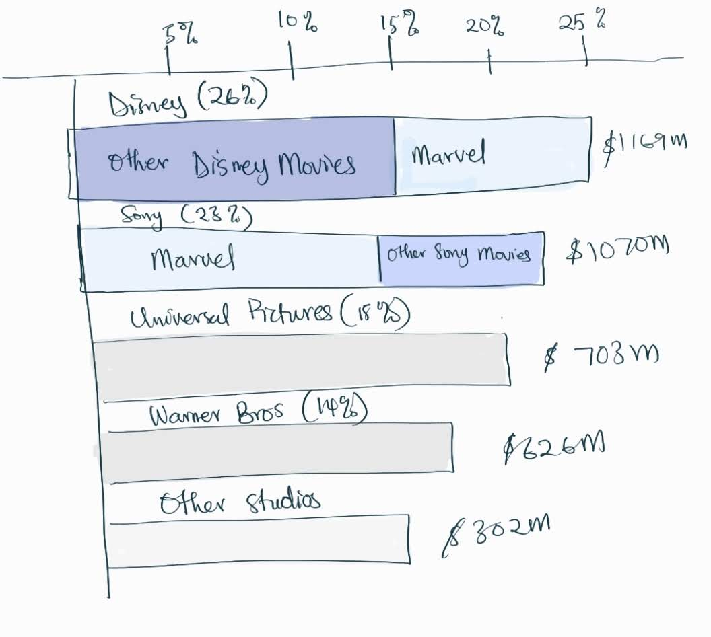
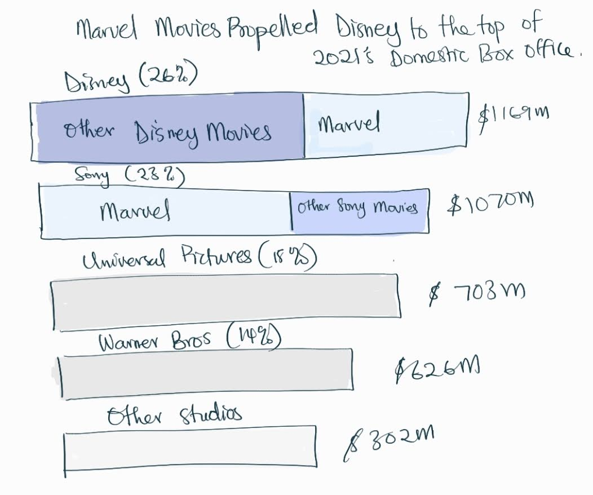
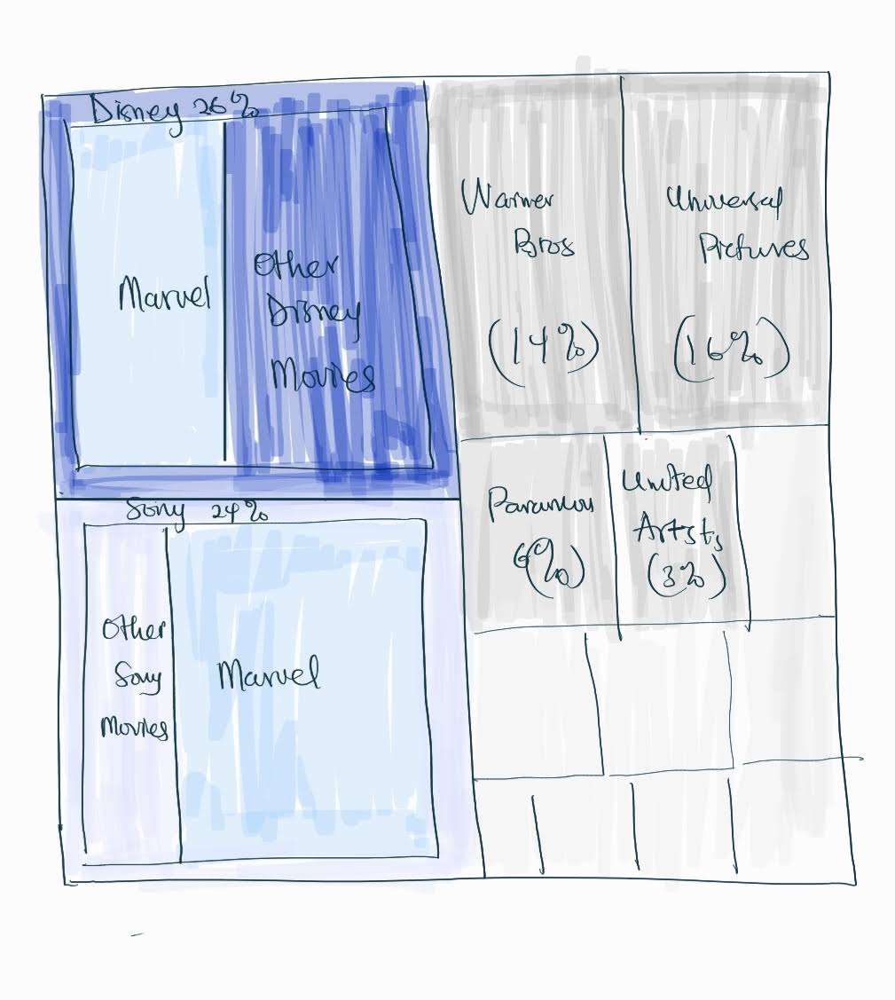

# Critique of CNBC's "Marvel heroes propelled Disney to overtake Sony at the top of the 2021 domestic box office."

## Step 1: find a data visualisation (with data you can use)!
The <a href="https://www.cnbc.com/2022/01/07/disney-topped-the-2021-domestic-box-office.html" target="_blank">CNBC article on "Marvel Heroes propelled Disney to Top 2021's Domestic Box Office"</a> contains the below visualisations aimed at communicating how Marvel movies helped Disney to become the leading studio in 2021 in terms of Box office earnings.

I chose this visualisation because I covered an exciting topic on how Marvel movies significantly impact the movie industry.

#### Step 1b: Getting the data
Although CNBC cited Comscore as the data source, there were no direct links to the data. 
I found a comparable data source from Box Office Mojo; the CNBC visualisation figures were consistent with that source:
It required scraping the table on the Box Office Mojo website, cleaning up the data and aggregating some smaller studios under their parent companies.
It was eventually arriving at comparable figures. NB: Numbers in the original article do not precisely match the numbers from the source I used, but it is reasonably close due to some small studios that are not aggregated or estimated in the original visualisation.

## Step 2: critique the visualisation
Summary:  
CNBC used five simplified and intuitive graphs:
- 1 “segmented bar graph”, 
- 3 “bar graphs” and a 
- 1 “3-column table” (with a small bar graph visualisation in the 3rd column) 
 

Source: <a href="https://www.cnbc.com/2022/01/07/disney-topped-the-2021-domestic-box-office.html" target="_blank">CNBC Entertainment</a>
 

These visuals conveyed the message, "Marvel Heroes propelled Disney to Top 2021's Domestic Box Office", but not very effectively.
The visuals focused on the North American domestic Box Office and used numbers to concentrate on that audience.
Although these five visualisations are individually clear and contain facts, they do not effectively highlight the main point (i.e., Marvel movies helped Disney top the box office). 
The viewer must mentally piece together the visualisations and draw a conclusion that is not obvious in the visualisations. 
The Marvel movies were not highlighted, so it is assumed that every reader already knows which movies are Marvel movies. Unfortunately, this assumption may cause readers who are not subject matter experts to miss the point of the visualisations.
The average entertainment segment reader of CNBC articles may appreciate one or two simple visualisations that already provide direct visual comparisons. They would also enjoy some interactive design that allows them to explore the data.   
In summary, the five visuals are aesthetically simple and clean but are not directly addressing the point. 
They are useful, true, and intuitive but may need some improvement to make them collectively useful to the reader and perceptible (convey the article's point more directly).

Scores
- Usefulness: (6/10)
- Completeness: (7/10)
- Perceptibility: (7/10)
- Truthfulness: (6/10)
- Intuitiveness: (7/10)
- Aesthetics: (7/10)
- Engagement: (5/10)

## Step 3: wireframe a solution
Based on the critique, I assessed the data and realised that this kind of information could be better represented with 
-  Segmented bar graph
-  Tree Maps

#### Solution 1: Segmented Bar
The first idea was to capture the marvel and non-marvel movie segments within the same bar graph, so it is obvious how each component impacted the general performance. 
The bar graphs were then ordered from the top-ranked studio to the least ranked to make it obvious that Disney was the leading studio. 

#### Solution 2: Treemap
A treemap tries to capture everything in proportion.

## Sept 4: test the solution (get feedback)
People from different backgrounds were interviewed, including an architect, social worker, data analyst, human resource person etc. This was to help see the visualisations from a different viewpoint.

Some people found the treemap concept confusing, while others (like the architect) found visualisation very intuitive. But the general idea was that both proposed solutions made getting the image conveyed by the title easier. Some improvements were suggested concerning the use of colour and the orientation of the bar graphs.

A report of the interviews is summarised below:
<a href="https://docs.google.com/forms/d/19SKseS_ksZhfiW71MLcn495kR6TKzsdJsj6n60cgaVU/viewanalytics" target="_blank">Link to solution testing interviews - feedback</a>

#### improvements to designs (after feedback)
Solution 1: review 1

Further simplification and removing duplicate information resulted in 
Solution 1: review 2

Solutions 2: review 1

The raw data contains a lot of information that could be hidden behind these designs and reviewed through interactive design tools available in Flourish. This simplifies the overview of the visualisation for viewers who just want a gist and allows curious viewers to drill down to discover movies of interest.

## Step 5: Build your Solutions

#### Solution 1: Segmented bar graph
The final solutions allowed the viewer to engage with the designs and uncover more information if needed:

This is the bar graph that shows how Marvel movies pushed Disney to the top

#### Solution 2: Treemap graph
A treemap reveals the proportions of the various segments and directly shows how much of an impact Marvel movies had on Disney studio's performance. 

## Final classroom review
The solution was shared with a group of 4 colleagues, and the following suggestions were made
- The colour is too faint; hard to read the labels/text
- the use of colour for the "Other Marvel Movies" and "Other Disney Movies" should be consistent
- Percentages to 2 decimal places is an unnecessary detail
- Colour scheme should reflect more of a MARVEL theme (matte red and white could be more relateable)
- Improve the title: Include Sony as a direct comparison to Disney

> Final visualization: Solution 1 

> Final visualisation: Solution 2

Conclusion:
The design process was iterative, and getting feedback from friends and peers helped me see the visualisation in a different light.
I can understand that the original design was probably done within a shorter period, which did not allow for such elaborate considerations in design. Nevertheless, I hope my redesign adds value to the insightful message captured by the author in this CNBC article.

By Michael Affare

