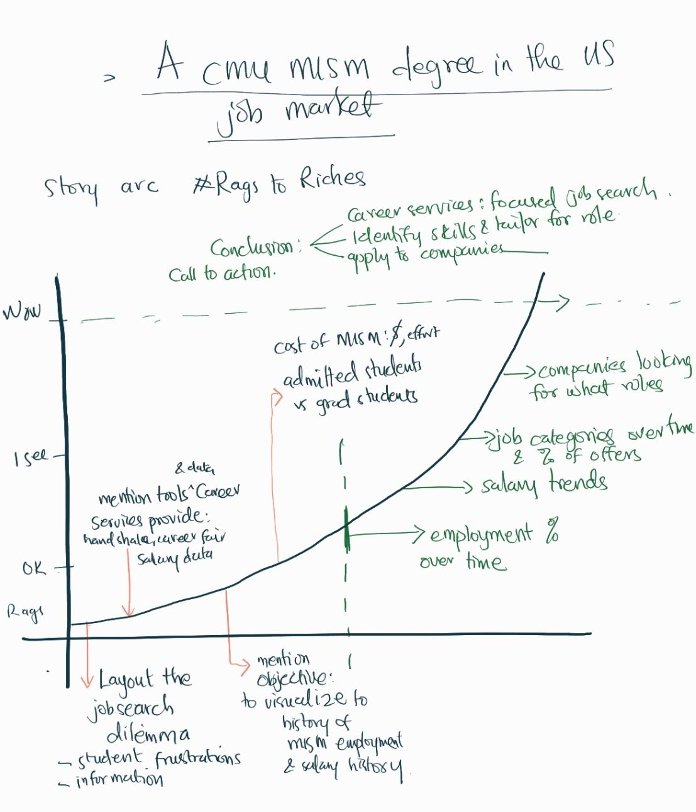
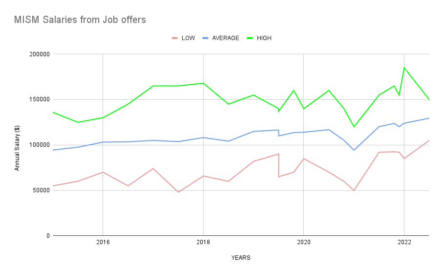
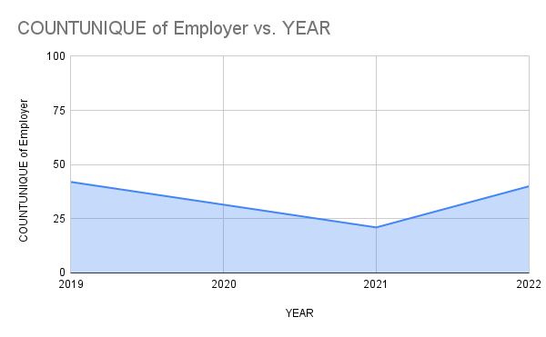
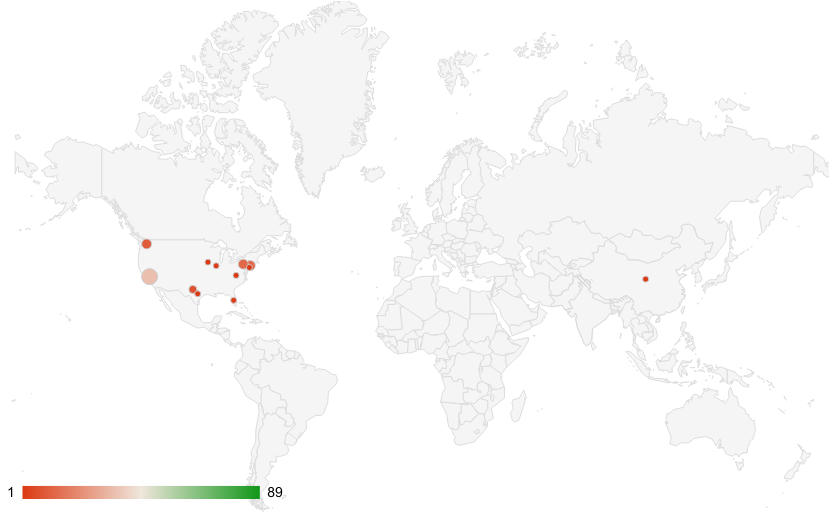
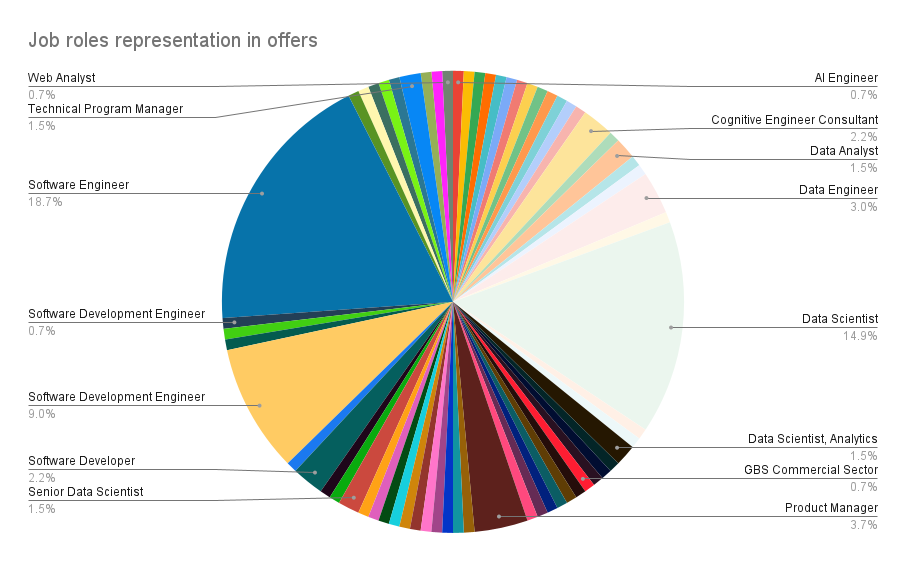
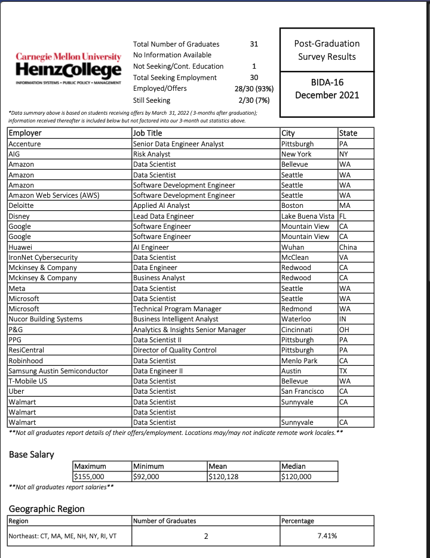

# Carnegie Mellon University's Master of Information Systems Management (MISM) employment history and salaries
## a report on the previous trends and expectations

[Home](readme.md)

### Outline
As a final year Master of Information Systems Management (MISM) student at Carnegie Mellon University, one primary task is job hunting. However, with all the career fairs, handshake postings, seminars and expectations, it may be difficult for a MISM student to have a clear mental picture of the options available, results from previous years and even the salary expectations. 

This project seeks to create a clear image in the minds of MISM students concerning the job application process. 
This project will arm the student with:
- Salary expectations
- Options with Job roles
- The companies that frequently offer jobs
- Same likely locations of the jobs offered
- General idea of employment rates (the rate at which students get offers)

Being able to tell this story over the years will equip the MISM student with handy information on where to start the job search, what roles to focus on and what salary expectations are reasonable.

The project's scope has been limited to the MISM program, so a clear and detailed story can be told.

The primary consideration will be to develop an opinion or conclusion from the data to answer questions like
- Is the CMU MISM program worth the money? 
- Is a student likely to complete the program and get an offer?
- Are companies paying more for MSISM students over the years?
- Is it easy to find jobs in the US for MSISM students?
- What career path is likely to get a job in MISM?
- What are the go-to companies during job hunts?

#### Audience
This story is intended for 
1. Carnegie Mellon University MISM students
2. Prospective CMU MISM students
3. Faculty 
4. Staff (Career Services, Admissions Office etc)
5. General readers

#### Story arc 
The "Rags to Riches" story arc has the plot of students who pursue a demanding degree in the hope of landing a good-paying tech jobs through the help of CMU and the MISM program.
It will highlight the dilemma of job search and the information overload of career fairs, events and handshake posts.

> A CMU MSIM degree in the US job Market

The narrative should subtly answer the below questions for the reader:
1. How many students apply for MSISM and complete the program?
2. What has been the employment rate of students who graduate from the MISM program?
3. What are the categories of job roles that are frequently seeking MISM graduates? (Do you have the skills?)
4. Job hunt: What companies should you consider for the roles mentioned?
5. Salaries: What is a reasonable salary expectation for a MSISM student?
6. What locations could you end up in when offered a job? And where are you likely to find alums working?
7. Conclusion 1: Summary; the value of a CMU MISM degree
8. Conclusion 2: Call to action: See career services, identify your skills and matching roles, and target the companies listed that offer those roles.

### Sketches

##### Excel graphs
Very basic visualizations were tested within excel to have a fair idea of what story is being told by the data.
Although this has a poor design layout, it gives a preliminary view of the data and provides a blueprint for sketching and prototyping visualizations within other tools.

> Salary Ranges Over Time

> Count of Companies that gave offers each year

> Popular locations for CMU MISM program jobs

> Popular job roles for MSISM graduates

#### Flourish visualizations
After importing the data into Flourish, more advanced and cleaner visualizations were tested using the concepts developed from the initial data exploration in excel.
More advanced visualizations that answer questions like
1. Heat map: The roles frequently offered by each company 
2. Segmented bar graph: Job role categories and the percentages they represent in the total offers within each year

### Data

Most of the data may be found at <a href="https://www.heinz.cmu.edu/current-students/career-services/employment-information-salary-statistics" target="_blank">heinz.cmu.edu Employment Information Salary Statistics</a> as PDFs organized by program.

> A sample PDF data

With the help of <a href="https://tabula.technology/" target="_blank"> Tabula (PDF data extraction tool)</a> the data was extracted into an excel sheet so insights can be drawn from the structured data.
At this point the data sets to be used are available, public and accessible; however there is a lot of outstanding work to extract/scrape, clean, aggregate and generate summary statistics to support this story.

> Resulting data sets
[X] <a href="https://www.heinz.cmu.edu/current-students/career-services/employment-information-salary-statistics" target="_blank"> Raw PDF data on CMU website</a>
[X]  Matriculation/enrollment counts: The Heinz Admissions Office provided some matriculation counts over email correspondence.
[ ] <a href="https://docs.google.com/spreadsheets/d/1tBsIfc-lboYxNFbu3CW3X2cO1hVZPUelgzTBsIz3ZP8/edit?usp=sharing" target="_blank"> Cleaned data</a>

> Data aggregation:
Because there are several data points and years, it is essential to aggregate the data so too much information is not presented at a time. The classification of data into years, job role categories, geographical sections and program tracks help to summarize the data even more and provides an opportunity for interactive design.

#### Method and medium
The strategy to complete the project is outlined below:
> Complete data extraction and accuracy check:
With the aid of Tabula, all the PDF files for MSISM will be converted to Excel relational tables.
This scopes 32 PDF files that include all MISM (i.e Global 21 month track, BIDA, 16 month track, 12 month track) data from 2015 to date.

> Aggregate data into meaningful categories:
The extracted data will need further processing to introduce new columns that improve the data visualisation:
Some of the aggregation tasks may include
-  Years
-  Job role categories (e.g. software developers)
-  Employeer 
-  Introduce decimals to identify graduation months (for time series graphs to show distinctions between graduation batches data)

> create summary statistics from the data:
Some general statistics will require grouping the categorized data and calculating the counts, averages etc.
This will also help to rank the results and focus on the top categories whiles blurring other smaller categories.

> Load data into Flourish and Tableau (visualization tools)
The data (both detailed and summary statistics) will be loaded into Flourish and Tableau and properly formatted so visualizations can be generated.

> Explore visualization options:
This is where a lot of experimentation will be required to come up with the ideal visualisation styles that effectively communicate the story. 

> Get feedback for the visualizations and iteratively improve the visualizations
Visualization ideas will be saved and shared with friends for feedback and improvement.

> Develop an opinion/story based on the insights from the project
Based on the numbers and visuals a story conclusion can be derived; this will inform the perspective and tone of the story being told. As at now the story perspective is not clear however the questions to be answered are the goal and that will guide the process of this story telling.

> Create a shorthand story.
A shorthand story will be created to capture the project findings and story. This will be published publicly.
Images to be used will be from the CMU website or images that have personally been taken during the job search; these are not expected to have any trademark violations or copyright restrictions.

> Test the shorthand story arc with reviewers and make improvements.
Test the story with friends and family and use construction critique feedback to improve the story arc, content and visualizations.

[Back](readme.md)

